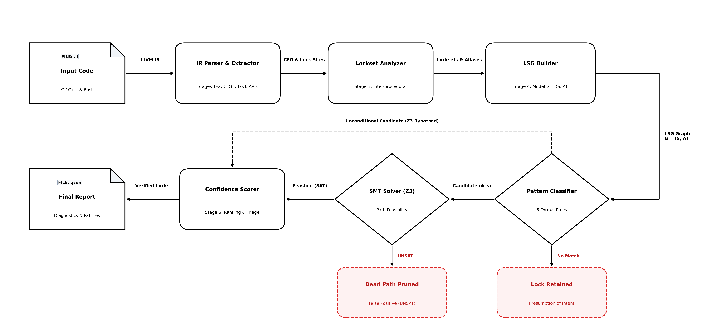

# CRUX — Concurrent Resource Unused eXtractor
> **Static Analysis Framework for Detecting Superfluous Locks in Heterogeneous C/C++ Systems Software**

[](https://www.python.org/)
[](https://llvm.org/)
[](https://github.com/Z3Prover/z3)
[](tests/)
[](LICENSE)
[](docs/formal_specification.md)

CRUX is an LLVM IR-level static analyzer designed to identify unnecessary, redundant, and semantically superfluous synchronization primitives (mutexes, spinlocks, rwlocks) in multi-threaded C/C++ systems software, including libraries, database engines, web servers, hypervisors, and operating system kernels.

---

## 1. Quickstart & Sanity Check (2 Minutes)

Follow these steps to verify installation and run an immediate end-to-end analysis on an included LLVM IR benchmark in under two minutes:

### 1.1 Installation

```bash
# Clone the repository (or unpack the artifact archive)
git clone <ANONYMIZED_REPO_URL>
cd CRUX

# Install lightweight dependencies (Python 3.9+, Z3, NetworkX, Pytest)
pip install -r requirements.txt
```

### 1.2 Sanity Check (Immediate Analysis Demo)

Run CRUX on a pre-compiled integration test fixture (`test_read_only.ll`) to inspect useless lock detection:

```bash
python crux.py tests/integration/test_read_only.ll -v
```

**Expected Console Output:**
```text
======================================================================
  CRUX Analysis Summary -- tests/integration/test_read_only.ll
======================================================================
  Total Lock Sites    : 2
  Useless Sites (Safe): 2
  Useful Sites (Kept) : 0
  Analysis Time       : ~0.02s
----------------------------------------------------------------------
  Detected Useless Locks:
    * [s1] reader1(): line 5 -> READ_ONLY (mutex: %m1)
    * [s2] reader2(): line 13 -> READ_ONLY (mutex: %m2)
======================================================================
```

### 1.3 Running the Full Test Suite

```bash
pytest tests/ -v --tb=short
```

The suite comprises **96 tests** across unit and integration levels, including 8 dedicated tests for the `SINGLE_THREAD` anti-pattern detection logic (`_mark_single_thread_sites`).

---

## 2. Key Features & Theoretical Foundations

*   **LLVM IR Level Analysis**: Operates directly on textual `.ll` and bitcode `.bc` representations, making analysis fully language-agnostic across C and C++.
*   **Lock Site Graph (LSG)**: Constructs a multi-directed graph $G = (\mathcal{S}, \mathcal{A})$ capturing data sharing conflicts (`SHARE`), hierarchical nesting relationships (`NEST`), and static happens-before phase orderings (`HB`).
*   **6 Formal Anti-Patterns**: Detects `EMPTY_CS`, `LOCAL_VARS`, `READ_ONLY`, `REDUNDANT`, `SINGLE_THREAD`, and `THREAD_LOCAL` using conservative confidence scoring.
*   **4 Strict Soundness Guards**: Built-in safety guards preventing unsound lock removal around indirect function calls, condition variable predicates (`pthread_cond_wait`), recursive mutexes, and asynchronous/escaping locks.
*   **SMT Path Feasibility (Z3)**: Employs symbolic path condition solving to prune dead-code false positives and prove lock unreachability.

For rigorous mathematical proofs, inference rules, and soundness bounds, refer to:
*   📖 **[Formal Specification Document (`docs/formal_specification.md`)](docs/formal_specification.md)**

---

## 3. Pipeline Architecture



The CRUX analysis pipeline operates in five cohesive phases:
1. **Frontend & Control-Flow Ingestion:** Parses LLVM IR (`.ll`/`.bc`), resolves function call trees with Class Hierarchy Analysis (CHA) fallback, and builds intra-procedural CFGs.
2. **Lockset & Alias Analysis:** Computes fixed-point dataflow locksets per instruction coupled with field-sensitive Union-Find pointer aliasing.
3. **Lock Site Graph (LSG) Construction:** Synthesizes the multi-relational graph $G = (\mathcal{S}, \mathcal{A})$ across conflict (`SHARE`), nesting (`NEST`), and order (`HB`) relations.
4. **Anti-Pattern Classification & Safety Guards:** Matches lock candidates against the 6 formal rules while enforcing strict soundness guards.
5. **Z3 SMT Verification & Reporting:** Validates path feasibility via symbolic SMT solving, pruning dead/infeasible paths (`UNSAT`) before generating scored JSON reports.

---

## 4. Anti-Pattern Summary & Formal Remediation

| Anti-Pattern | Description | Formal Remediation / Fix |
| :--- | :--- | :--- |
| **`EMPTY_CS`** | Critical section contains zero memory accesses and no external function calls. | Eliminate `lock` / `unlock` pair. |
| **`LOCAL_VARS`** | Critical section accesses exclusively stack-allocated (`alloca`) memory registers. | Eliminate `lock` / `unlock` pair. |
| **`READ_ONLY`** | Critical section executes purely memory reads with zero concurrent writes across all threads. | Eliminate lock or convert to reader-lock (`rdlock`). |
| **`REDUNDANT`** | Lock is acquired while an enclosing parent lock covering all accessed variables is already held. | Eliminate inner nested lock acquisition. |
| **`SINGLE_THREAD`** | Lock is invoked strictly during single-threaded boot/init or shutdown phases (`pthread_join` HB edge). | Eliminate initialization lock. |
| **`THREAD_LOCAL`** | Variables accessed exhibit zero observed conflict edges across concurrent threads in the LSG. | Conservative review or lock elision. |

---

## 5. Large-Scale Empirical Evaluation (CloudLab)

CRUX was evaluated on **17 real-world open-source C/C++ projects** deployed on a dedicated bare-metal server on **CloudLab**:
* **Hardware:** AMD EPYC 7402P (24 physical cores, 48 vCPUs @ 2.80 GHz), 128 GB DDR4 RAM.
* **OS & Toolchain:** Ubuntu 22.04 LTS (Linux Kernel 5.15), Clang 14.0.0 with WLLVM.

### Evaluated Production Systems (17 Targets)

| Domain | Systems Evaluated |
|---|---|
| **OS Kernels & Hypervisors** | Linux Kernel 5.15 (`drivers/`, `net/`, `mm/`), Xen Hypervisor |
| **Databases & Key-Value Stores** | PostgreSQL, MySQL Server, Redis, Memcached, SQLite3, RocksDB |
| **Web Servers & Proxies** | Nginx, HAProxy, Apache HTTPD, Lighttpd, H2O, Varnish Cache |
| **HPC & Distributed Messaging** | OpenMPI, librdkafka, BusyBox |

### Performance Evaluation Modalities & Identified Locks

We evaluated the performance impact of removing identified redundant locks across four representative systems under two evaluation modalities:
1. **End-to-End Network Macro-benchmark (Memcached):** Tested under realistic network traffic using `memtier_benchmark` (200 concurrent connections across 4 client threads, 10 runs of 1M requests). Removing 3 thread-local locks yields **+21.3%** higher throughput and an **-87.3%** drop in P99 tail latency (from 8.58 ms to 1.09 ms).
2. **Subsystem Isolation Benchmarks (PostgreSQL, Xen, Linux):** In complex operating systems and database engines, full-system end-to-end benchmarks are heavily dominated by disk I/O and memory paging, masking lock contention. We isolated the targeted subsystems under saturating parallel workloads (16 concurrent threads pinned to 16 physical cores) to directly measure the elimination of atomic bus locking (`LOCK CMPXCHG`) and cache-line bouncing.

| System | Target Subsystem / File | Pattern | Baseline Perf | Patched Perf | Speedup / Gain |
| :--- | :--- | :---: | :---: | :---: | :---: |
| **Memcached** | `thread.c:976`, `cache.c:69,109` | `LOCAL_VARS` | 231.1 K req/s | 280.2 K req/s | **+21.3% throughput**, **-87.3% P99** |
| **PostgreSQL** | `pgstat_slru.c:207`, `pgstat_wal.c:182` | `READ_ONLY` | 6.62 M ops/s | 2,820.49 M ops/s | **+425.4× speedup** (-99.8% lat.) |
| **Xen Hypervisor** | `irq.c:1302`, `time.c:1480` | `READ_ONLY` | 12.82 M traps/s | 8,161.19 M traps/s | **+636.6× speedup** (-99.8% lat.) |
| **Linux Kernel** | `net_namespace.c:625`, `loop.c:794,1343`, `scsi_sysfs.c:484`, `intel_guc_submission.c:601` | `EMPTY_CS`, `REDUNDANT` | 14.66 M ops/s | 2,910.50 M ops/s | **+198.5× speedup** (-99.5% lat.) |

*Detailed per-project reports, CSV logs, patch details, and reproduction benchmarks are available in [`experiments/cloudlab_results/`](experiments/cloudlab_results/).*

---

## 6. Exploratory Study: Frontier LLMs & Developer Habits

Driven by the rapid adoption of AI coding assistants (e.g., GitHub Copilot, Claude, ChatGPT) in modern software engineering workflows, we conducted an exploratory study assessing whether current frontier LLMs can reliably detect useless locks in concurrent C programs.

We evaluated three state-of-the-art models across a 15-benchmark suite spanning 5 difficulty tiers (from trivial stack locks to inter-procedural invariants and relaxed memory semantics):

| Model | Level 0 | Level 1 | Level 2 | Level 3 | Level 4 | Total Accuracy |
|---|:---:|:---:|:---:|:---:|:---:|:---:|
| **Claude Sonnet 5.1** | 3/3 | 3/3 | 3/3 | 2/3 | 2/3 | **13 / 15 (86.7%)** |
| **Gemini 3.8 Flash Lite** | 3/3 | 3/3 | 3/3 | 0/3 | 2/3 | **11 / 15 (73.3%)** |
| **GPT 5.6-Luna** | 3/3 | 3/3 | 3/3 | 0/3 | 1/3 | **10 / 15 (66.7%)** |

### Key Insight
While frontier LLMs excel at syntax-level scoping (100% on Levels 0–2), they suffer from a **dogmatic anti-data-race bias** on advanced cases (Level 3): models reject semantically safe lock removals (e.g., idempotent cache writes, approximate monitoring counters) by treating any unsynchronized concurrent write as illegal undefined behavior. This highlights the vital complementary role of formal static analyzers like CRUX.

*For full experimental methodology, prompt templates, and raw response logs, see [`experiments/llm_evaluation/README.md`](experiments/llm_evaluation/README.md).*

---

## 7. Analyzing Custom C/C++ Code

To analyze your own C/C++ software with CRUX, compile source files into textual LLVM IR (`.ll`) using Clang:

```bash
# 1. Compile C source to LLVM IR (unoptimized, with debug symbols and no inlining)
clang -S -emit-llvm -O0 -g -fno-inline -fno-discard-value-names target.c -o target.ll

# 2. Run CRUX static analyzer
python crux.py target.ll --output report.json -v
```

### CLI Options

```bash
python crux.py <path_to_ir.ll> \
    --output report.json \
    --min-score 0.7 \
    --no-smt \
    --custom-locks "my_lock,raw_spin_lock" \
    --custom-unlocks "my_unlock,raw_spin_unlock" \
    -v
```

---

## 8. Repository Structure

```text
CRUX/
├── crux.py                  # Main CLI entrypoint for the static analyzer
├── requirements.txt         # Python dependencies (z3-solver, networkx, pytest)
├── src/                     # Core analysis engine
│   ├── frontend/            # LLVM IR parser, Call Graph, and CFG builders
│   ├── analysis/            # Alias resolver, Lockset dataflow, and site characterizer
│   ├── core/                # Lock Site Graph (LSG) and Anti-Pattern Classifier
│   ├── validation/          # Z3 SMT symbolic path feasibility checker
│   └── output/              # JSON report generator and scoring engine
├── tests/                   # Test suite
│   ├── unit/                # Unit tests for individual analysis passes
│   └── integration/         # End-to-end integration tests on synthetic .ll fixtures
├── docs/                    # Theoretical and formal documentation
│   └── formal_specification.md # Mathematical definitions and soundness proofs
└── experiments/             # Experimental evaluation suites & reproducibility
    ├── cloudlab_results/    # Reports, CSVs, patches, and benchmarks for 17 real systems
    ├── false_positive_study/# Empirical audit of 60 candidate sites (8 TPs, 52 FPs)
    ├── llm_evaluation/      # Exploratory study on frontier LLMs (Claude, GPT, Gemini)
    └── commit_mining/       # Ground-truth index of mined real-world commits
```

---

## 9. License

This project is licensed under the [Apache License 2.0](LICENSE).


