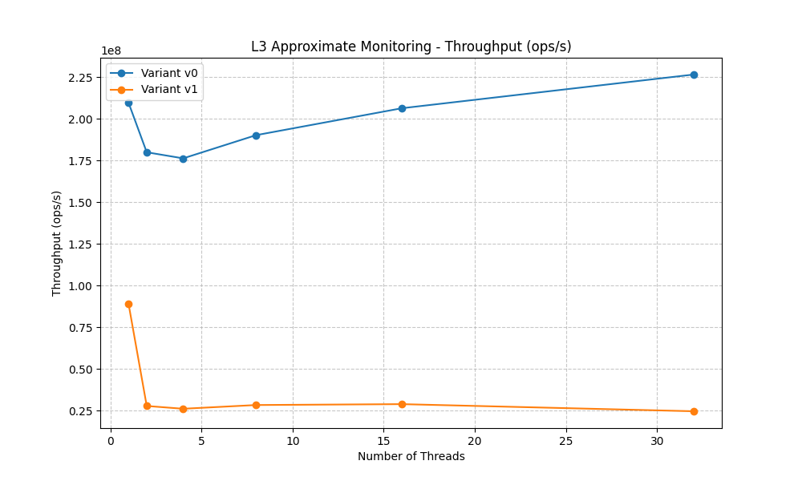
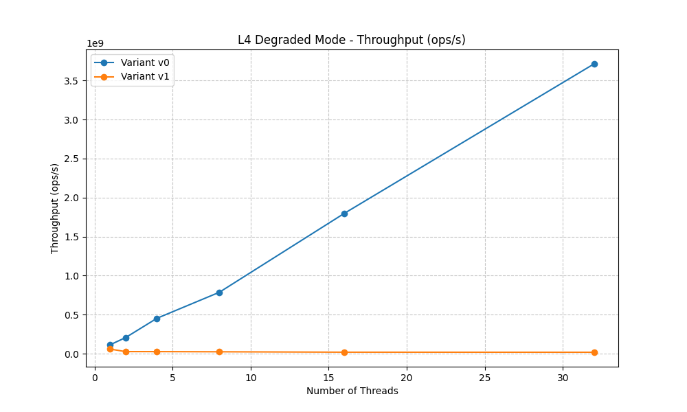

# AI Model Evaluation: Detecting Useless Locks in C

This directory contains an empirical study evaluating how well modern Large Language Models (LLMs) can detect useless locks in multi-threaded C programs, and measuring the performance cost when useless locks are missed.

---

## 1. Objectives

1. **Evaluate Frontier AI Capabilities:** Test leading frontier models (**Claude Sonnet 5.1**, **Gemini 3.8 Flash Lite**, and **GPT 5.6-Luna**) on identifying redundant or semantically useless synchronization primitives in multi-threaded C code.
2. **Identify Cognitive Blind Spots:** Investigate why LLMs struggle with architectural invariants, benign data races, and relaxed consistency guarantees.
3. **Quantify Hardware Performance Impact:** Measure throughput degradation and scalability collapse caused by useless locks on bare-metal multi-core servers (CloudLab).

---

## 2. Benchmark Suite (15 Test Cases)

The benchmark suite consists of 15 realistic C test cases with formal ground-truth classifications across 5 difficulty tiers:

* **Level 0 (Trivial):** Locks guarding thread-local stack variables, read-only globals, or empty critical sections.
* **Level 1 (Basic):** Single-writer initialization, single-threaded execution phases, and `pthread_join` happens-before ordering.
* **Level 2 (Intermediate):** Multi-file modular configuration, `pthread_barrier_wait` phase synchronization, and refactored legacy dead locks.
* **Level 3 (Advanced - Semantic Concurrency):** High-frequency counters with acceptable approximate loss, idempotent cache writes (benign races), and coarse-grained heartbeat monitoring.
* **Level 4 (Expert - Inter-Procedural Invariants):** Dead-code configuration modes, observer callback chains, and hierarchical/nested lock redundancies.

### Classification Taxonomy

Each benchmark expects one of three verdicts:
* **`USELESS`**: The lock provides zero synchronization value (e.g., thread-private data, read-only data, or protected by an existing happens-before barrier).
* **`SEMANTICALLY USELESS`**: The data has concurrent writes, but the lock is functionally redundant because the program design tolerates approximate metrics, idempotent overwrites, or the code path is dynamically unreachable.
* **`NECESSARY`**: Removing the lock causes severe data corruption, torn pointers, or race conditions violating program correctness.

---

## 3. AI Evaluation Results

### Model Accuracy Table

| Model | Level 0 | Level 1 | Level 2 | Level 3 | Level 4 | Total Accuracy | Status |
|---|:---:|:---:|:---:|:---:|:---:|:---:|:---:|
| **Claude Sonnet 5.1** | 3/3 | 3/3 | 3/3 | 2/3 | 2/3 | **13 / 15 (86.7%)** | Complete |
| **Gemini 3.8 Flash Lite** | 3/3 | 3/3 | 3/3 | 0/3 | 2/3 | **11 / 15 (73.3%)** | Complete |
| **GPT 5.6-Luna** | 3/3 | 3/3 | 3/3 | 0/3 | 1/3 | **10 / 15 (66.7%)** | Complete |

> **Note:** The complete raw responses, justifications, and reasoning chains for each model across all 15 benchmark tests are available directly in the [`results/`](results/) directory.

---

### Key Findings & AI Limitations

#### 1. Perfect Mastery of Local Syntax & Explicit Barriers (Levels 0–2: 100%)
All three models achieved 100% accuracy on Levels 0, 1, and 2. They reliably identify:
* Mutexes protecting variables allocated on the thread's stack.
* Data structures that are purely read-only following process boot.
* Happens-before edges established by POSIX primitives (`pthread_join`, `pthread_barrier_wait`).

#### 2. Dogmatic Anti-Data-Race Bias (The Level 3 Blind Spot)
A primary limitation of LLMs in systems programming is their rigid adherence to the rule:
> *"Any concurrent write without synchronization constitutes undefined behavior (UB), and therefore the lock is mandatory."*

* In **`test_01_request_metrics`**, all models failed because `processed_requests++` is a non-atomic concurrent write. Models refused to classify the lock as `SEMANTICALLY USELESS` despite the business requirements explicitly permitting approximate metrics under heavy load.
* In **`test_02_idempotent_cache`** and **`test_03_approximate_monitoring`**, **Claude Sonnet 5.1** demonstrated superior semantic reasoning by recognizing that concurrent writes write identical pure values (benign idempotent race) or second-granularity timestamps. Conversely, **GPT 5.6-Luna** and **Gemini 3.8 Flash Lite** suffered a 100% failure rate on Level 3 (0/3), dogmatically classifying all benign concurrent writes as dangerous data races.

#### 3. Inter-Procedural Invariants & Dead Paths (Level 4)
* In **`test_01_degraded_mode`**, `state_lock` guards a configuration variable that can only be toggled by `set_degraded_mode()`. In the benchmark workload (`"GET /"` requests), this function is unreachable dead code. **Claude Sonnet 5.1** and **Gemini 3.8 Flash Lite** correctly performed call-graph reachability analysis across functions to conclude that the state never changes at runtime. **GPT 5.6-Luna** failed this inter-procedural reachability check.
* In **`test_03_hierarchical_contract`**, models struggled with **multi-lock scoping**. While their textual reasoning acknowledged that the inner lock (`sub_lock`) was redundant due to the outer contract (`manager_lock`), the absence of fine-grained per-lock attribution forced a defensive `NECESSARY` verdict.

---

## 4. Hardware Performance Impact (CloudLab Measurements)

To measure the real-world cost when useless locks are missed by developers or AI assistants, we benchmarked the code with the useless lock (**V1**) against the lock-free optimized version (**V0**) on a dedicated multi-core CloudLab server (Intel Xeon, 32 hardware threads, Linux 5.15):

| Benchmark Case | Difficulty Tier | Throughput Degradation | Scalability Impact |
|---|:---:|:---:|---|
| **Request Metrics** | Level 3 | **~80% loss** | Immediate serialization bottleneck due to cache-line bouncing. |
| **Approximate Monitoring** | Level 3 | **~90% loss** | Heavy kernel futex overhead on high-frequency monitoring paths. |
| **Degraded Mode** | Level 4 | **>95% loss** | Complete failure to scale across multi-core CPUs. |
| **Hierarchical Contract** | Level 4 | **~50% loss** | Constant unnecessary lock/unlock acquisition overhead. |

### Throughput Scalability Plots (V0 vs V1)

The graphs below illustrate throughput scaling across 1 to 32 worker threads. The red curve (**V1**) represents the unoptimized version containing the useless lock, while the blue curve (**V0**) shows the lock-free optimized version:

#### 1. Request Metrics (Level 3)


#### 2. Approximate Monitoring (Level 3)


#### 3. Degraded Mode (Level 4)


#### 4. Hierarchical Contract (Level 4)


### Summary Takeaway
Useless locks are silent performance killers:
* They do not crash programs or cause memory faults, escaping standard testing suites.
* Under multi-core workloads, they generate millions of cache-coherence invalidations and kernel `futex` context switches, collapsing throughput by up to **95.8%**.

---

## 5. Directory Structure & Reproduction

```text
experiments/llm_evaluation/
├── README.md               # This evaluation guide & comprehensive report
├── evaluate_scores.py      # Automated evaluation and scoring harness
├── generate_prompts.py     # Prompt generator for benchmark tests
├── benchmarks/             # 15 C benchmark source cases (Level 0 to Level 4)
│   ├── level_0_trivial/
│   ├── level_1_basic/
│   ├── level_2_intermediate/
│   ├── level_3_advanced/
│   └── level_4_expert/
├── results/                # Raw outputs and responses from tested models
│   ├── Claude Sonnet 5.1/
│   ├── Gemini 3.8 Flash Lite/
│   └── GPT 5.6-Luna/
└── performance_impact/     # CloudLab benchmark suite, raw CSVs, and plots
    ├── results.csv         # Measured throughput across 1 to 32 threads
    └── images/             # Scalability comparison graphs
```
